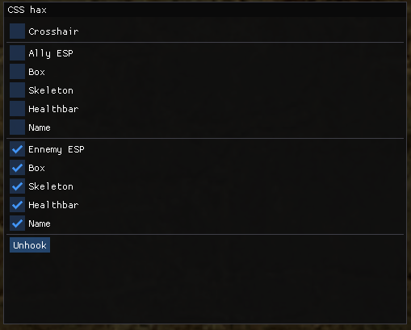

# CSS-external
A simple CS:S external cheat

This cheat is based of [ImGuiExternal](https://github.com/furkankadirguzeloglu/ImGuiExternal) which is the overlay part of the program. 
It also uses [valve-bsp-parser](https://github.com/ReactiioN1337/valve-bsp-parser) to parse BSP maps. 
Also i only use RPM so i don't write anything to the game, i still open a handle and ReadProcessMemory but it's fine for CS:S ig. 
I've tested the cheat on multiple servers, and on LAC, it is undetected even chen playing with the aimbot. 
The code isn't very good nor optimized but at least i have the good offsets. 

# Features
* Visibility check with BSP parsing
* Ally/Enemy ESP
* Skeleton ESP
* Box ESP
* Healthbar
* Name ESP
* Legit aimbot (MOUSE1)
* Crosshair

# Usage
`git clone https://github.com/ALittlePatate/CSS-external --recursive` 
Compile in x64 Release mode. 
Start the game then launch the cheat. 
Press INSERT to open the menu. 
Press DELETE or "unhook" in the menu to unload the cheat. 
Press HOME to trigger the aimbot (keeping this keybind for testing) 
As i use an overlay you can easily stream your game with obs/discord without anyone seeing the ESP. 

# Screenshots
[Demo video](https://streamable.com/8dg58q) 

ESP : 

Menu : 

# Known issues
* Performances can be better
* The ESP has a bit of latency
* Skeleton ESP can be buggy in some frames for some reasons
