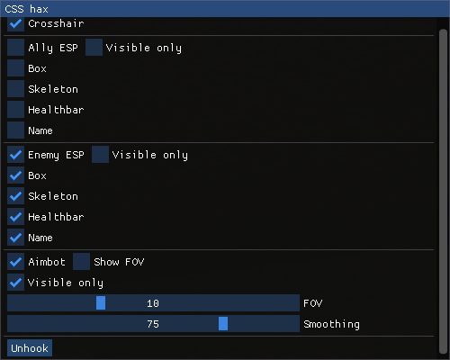

# CSS-external
A simple CS:S external cheat

This cheat is based of [ImGuiExternal](https://github.com/furkankadirguzeloglu/ImGuiExternal) which is the overlay part of the program. 
The code isn't very good nor optimized but at least i have the good offsets.

# Features
* Ally/Ennemy ESP
* Skeleton ESP
* Box ESP
* Healthbar
* Name ESP
* Crosshair

# Usage
Compile in x64 Release mode. 
Start the game then launch the cheat. 
Press INSERT to open the menu. 
Press DELETE or "unhook" in the menu to unload the cheat. 
As i use an overlay you can easily stream your game with obs/discord without anyone seeing the ESP. 

# Screenshots
ESP : 

Menu : 

# Known issues
* Performances can be better
* The ESP has a bit of latency
* Skeleton ESP can be buggy in some frames for some reasons
